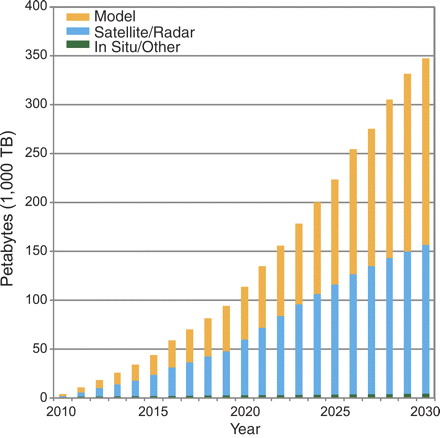

 


## A brief history of reproducibility

 


 

## Galileo's Anagrams

### smaismrmilmepoetaleumibunenugttauiras

 

## Kepler's solution

### Salve umbistineum geminatum Martia proles.

### "Be greeted, double knob, children of Mars.

 


## Altissimum planetam tergeminum observavi.

 

### I have observed the highest of the planets [Saturn] three-formed


 
## A solution


 

## Scientific Journals, 1665: what a clever solution 

Solves several key problems:

- Distributional problem. (yay printing press!)
- Social problem: how does one establish presedence?
- Results fully described, could be reproduced

 

## 1666


> ...In the beginning of the year 1666...I procured me a Triangular glass-Prisme, to try therewith the celebrated Phaenomena of Colours. And in order thereto having darkened my chamber, and made a small hole in my window-shuts, to let in a convenient quantity of the Suns light, I placed my Prisme at his entrance, that it might be thereby refracted to the opposite wall. It was at first a very pleasing divertisement, to view the vivid and intense colours produced thereby

## and all was well for 300 years...


## and then, along comes peer review?


## no, not that


## Methods have outgrown our journals

## Increase in data


 

## Increase in data


 

## Increase in data


 

## Increase in data



 

## Increase in software

[Hannay 2009](https://doi.org/10.1109/SECSE.2009.5069155)

 

## back to anagrams? 


## Economist


 

## Economist


 
## Economist


 
## Economist


## TALES FROM THE TRENCHES


## Reproduciblity attempts

### Quantifying Reproducibility in Computational Biology: The Case of the Tuberculosis Drugome

Garijo et al; 2013 (Phil Bourne's lab, NIH Data Science Director)

<https://doi.org/10.1371/journal.pone.0080278>


## Bourne Lab


## Bourne Lab


## Bourne Lab


## Bourne Lab


## NSECent Informatics Team 

<https://storify.com/hlapp/reproducibility-repeatability-bigthink>


- A 2014 study from L. A. Barba's lab: figshare bundles (data + code + figure) for each figure in the paper; bitbucket for main code repo; all code in Python
- White et al (2012): github for code & data for analysis pipeline; also includes instructions for only running portions of pipeline (including generation of figures); all code in Python
- Boettiger's 2012 study: uses github for code & issue tracker; code + data to generate figures; data on Dryad; all code in R <http://dx.doi.org/10.1098/rspb.2012.2085>

## NSECent Informatics Team 

<blockquote class="twitter-tweet" data-lang="en"><p lang="en" dir="ltr">.<a href="https://twitter.com/weecology?ref_src=twsrc%5Etfw">@weecology</a> <a href="https://twitter.com/cboettig?ref_src=twsrc%5Etfw">@cboettig</a> <a href="https://twitter.com/LorenaABarba?ref_src=twsrc%5Etfw">@LorenaABarba</a> The <a href="https://twitter.com/NESCent?ref_src=twsrc%5Etfw">@NESCent</a> informatics team takeaway today: even reproduction-ready papers are hard to reproduce.</p>&mdash; Todd Vision (@tjvision) <a href="https://twitter.com/tjvision/status/435920815235018752?ref_src=twsrc%5Etfw">February 18, 2014</a></blockquote>
<script async src="//platform.twitter.com/widgets.js" charset="utf-8"></script>


## Arizona reproducibility study: software realities


<http://reproducibility.cs.arizona.edu/>


## Statistical issues


30% of results using STRUCTURE not reproduced, even when data and code were avialable:
<https://doi.org/10.1111/j.1365-294X.2012.05754.x>


## TOWARDS SOLUTIONS


## The Computational Compendium

### Packaging data analytical work reproducibly using R (and friends)

<http://doi.org/10.1080/00031305.2017.1375986>

 


## Literate Programming

 

## GitHub

## R package structure

```
DESCRIPTION
README.md
.travis.md
R/
analysis/
|
├── paper/
│   ├── paper.Rmd         # this is the main document to edit
│   ├── references.bib    # this contains the reference list information
│   └── journal-of-archaeological-science.csl
|                         # this sets the style of citations & reference list
├── figures/
|
├── data/
│   ├── raw_data/       # data obtained from elswhere
│   └── derived_data/   # data generated during the analysis
|
└──  templates
    ├── template.docx  # used to style the output of the paper.Rmd
    └── template.Rmd
```

## Continuous Integration


## Docker


- <http://dx.doi.org/10.1145/2723872.2723882>


## Rocker Project 


- Reproducible software environment (excludes kernel differences, hardware differences)
- Transparent build recipe: Dockerfiles, not images
- Leverage reproducible sources: `debian:stable`, CRAN snapshots
- Focus on usability (RStudio interface, easy to extend)
- Actively test, actively maintain
- <https://rocker-project.org>


## Rocker Project


## Zenodo Archiving


## ADOPTION


## The tools are there, we just need to use them.

> Myth 3: We need new platforms for reproducible computational science

<http://ivory.idyll.org/blog/2014-myths-of-computational-reproducibility.html>

## Or are they?

Well-designed tools make a big a difference:

- sourceforge/subversion -> GitHub
- VMs -> Docker
- Sweave -> Rmd

Significant usability gaps remain!

<https://ropensci.org/blog/2014/06/09/reproducibility/>

## What is useful?

> Myth 5: GUIs are the way to go, because scientists might actually use easy-to-use software.

- Interoperability (API) first
- Extensibilty: lego blocks
- Existing context / language


## Incentives


<small><small>Stodden (IASSIST 2010) sampled American academics registered at the Machine Learning conference NIPS (134 responses from 593 requests (23%). Red = communitarian norms, Blue = private incentives</small></small>


## Incentives


<small><small>Stodden (IASSIST 2010) sampled American academics registered at the Machine Learning conference NIPS (134 responses from 593 requests (23%). Red = communitarian norms, Blue = private incentives</small></small>


<!--
## FitzJohn et al

<https://ropensci.org/blog/2014/06/09/reproducibility/>

### Using canonical data sources

> issues such as taxonomic standardisation remain a real stumbling block for ecological data reuse.

### Combining thoughts and code

> working with blocks of ugly data-wrangling code, or with long-running calculations, remains a challenge.

### Dynamic generation of figures

Check.

### Automated caching of dependencies

cache invalidation?

### Version control, continuous integration

Check.

### Documenting dependencies

> software still a moving target
-->
